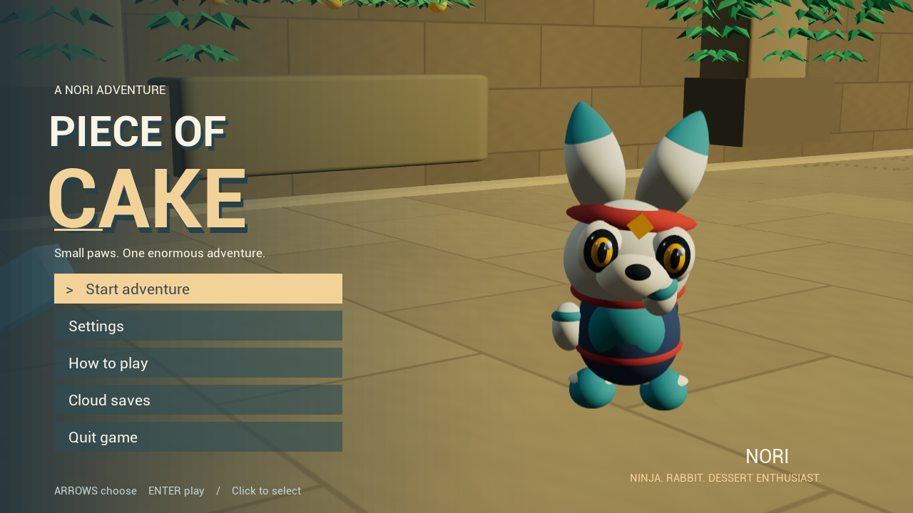

# Piece of Cake

An original ninja-rabbit platformer: eight enclosed districts, timed presses,
sentry courts, Echo bridges, rising lifts, crumbling floors and a cake worth the trip.



The v0.3 pass adds distinct architectural bays and room fixtures, softer surface
patterns, a second-jump somersault, spin trails, clearer guard anticipation and a
framed cake finale. These are rendered by the game, with its manual gameplay camera
and shadowless style preserved. [See the archive room](docs/validation/v03-district-3.png)
and [crystal grotto](docs/validation/v03-district-5.png).

## Play the Mac app

[Download v0.3.0 for Apple silicon Mac](https://github.com/Siddarth007th/piece-of-cake/releases/download/v0.3.0/PieceOfCake-0.3.0-mac-arm64.zip) · [Release notes and checksum](https://github.com/Siddarth007th/piece-of-cake/releases/tag/v0.3.0)

Complete 368.7 MiB download with optional live Supabase saves. Choose **Cloud saves → Connect** to create your private installation profile.

The main release is a standalone **Apple silicon Mac application**. No Unreal Editor,
Node, browser, account or game server is needed to play the downloaded app.
Unzip the release, move **PieceOfCake.app** into Applications and open it.
On the development Mac, **Piece of Cake** on the Desktop opens the installed copy.

This is an ad-hoc signed preview, not an Apple-notarized release. macOS may show an
unidentified-developer warning on downloaded copies. Do not disable system security.
The tested machine is an Apple M4 running macOS 26.7.1; Intel, Windows, mobile and
other macOS versions have not been runtime tested. The bundle targets macOS 14+.

Choose **Start adventure** and press Enter. The short cake dream can be skipped
with Enter or Space. Medium graphics targets 60 FPS; it is the tested default.
See [measured results and limits](docs/TEST_RESULTS.md). No bug-free guarantee is made.

| Action | Keyboard / mouse |
|---|---|
| Move freely | WASD |
| Jump / double jump | Space; release and press again |
| Run faster | Shift |
| Dash | Q / right mouse |
| Twist attack | J / left mouse |
| Slide / aerial slam | C / Ctrl |
| Echo / cake switches | E |
| Camera | Arrow keys; F toggles mouse look |
| Center camera | X |
| Pause / settings | Escape |
| Return to checkpoint | R |

Bombs and enemies remove hearts and knock Nori back. Falling empties all hearts
and returns to the checkpoint. Both cake switches cost 180 shards; backtracking
is allowed. Typing `siddarthisgod` toggles developer flight (WASD, Space up, C/Ctrl
down, Shift faster). Type it again to land at your current safe location; R is the
explicit checkpoint rescue. Fly beside the cake and press E to preview the ending
without buying the two switches. These runs are labelled assisted and unranked. Flight is excluded
from beatability tests. Gamepad bindings exist but have not been hardware tested.

## Source and builds

The project is on the Desktop at `~/Desktop/PieceOfCake`. Unreal Engine **5.8.3** is
installed; installation polling is paused. Source, imported meshes, materials,
audio, map and editable original art are included. Engine binaries, caches, local
saves, dependencies and packaged releases are excluded from Git.

Build requirements: Unreal 5.8.3, native C++ toolchain, Python 3, Node 22.12+ for the
optional web player. Set `UE_ROOT` for a nonstandard engine location.

```sh
python3 Scripts/ue.py doctor
python3 Scripts/package_mac.py Development
python3 Scripts/regression_local.py --executable /absolute/path/PieceOfCake.app/Contents/MacOS/PieceOfCake --label my-playtest --native --public-session
python3 Scripts/verify_native_features.py --executable /absolute/path/PieceOfCake.app/Contents/MacOS/PieceOfCake --label feature-check --cloud
python3 -m unittest discover -s Tests -v
npm --prefix Web ci
npm --prefix Web test
npm --prefix Web run build
```

The Mac packaging script stages the complete cooked app, validates its bundled
runtime libraries and signs it ad hoc. The native build cache is outside the
cloud-synced Desktop to avoid Finder metadata breaking bundle signatures.
Development configuration retains the runtime regression harness. Its public
stream launcher disables Unreal's console; developer flight remains available.

The three journey scenarios use ordinary physics, jumps and combat. They verify
the route, bomb damage, falls, checkpoints, Echo expiry, underfunded switches,
backtracking, cake and restart. They are automated engine traversals, not manual
browser playthroughs. Raw local evidence is under `Artifacts`; compact release
evidence is committed under `docs/validation`.

## Optional browser preview

**The app is the current priority. Public streaming is deferred.**
Double-click **Play Piece of Cake.command** for local Pixel Streaming; it prefers
the packaged game when available. Keep its terminal open; Control-C stops its
processes. Ports already in use are left untouched. The browser title menu only
starts when the real Unreal renderer is connected.

Vercel can serve the frontend, but does not supply the running Unreal GPU process.
The prepared **Host Online Preview.command** can host from this Mac through a free,
temporary Cloudflare tunnel after separate network testing. The Mac must stay awake
and online; one player shares one game instance. This is not an always-on hosted
release. See [deployment notes](docs/DEPLOYMENT.md).

All hosting must remain free. No paid service or automatically paid trial is authorized.

[Gameplay](docs/GAMEPLAY.md) · [Asset provenance](docs/ASSETS.md) · [Validation](docs/TEST_RESULTS.md)

## Cloud backend

The native app connects to a private anonymous cloud profile on first normal launch, with progress synchronization, completed-run history and a casual leaderboard. The backend uses Supabase Auth, HTTPS RPCs and PostgreSQL with per-player permissions. The Free backend is deployed: real HTTPS isolation tests and packaged native save/upload plus Keychain session restoration pass. Only the Free plan is allowed. Cloud saves can still be turned off from the menu. See [backend setup](Backend/README.md) and the [architecture / acceptance table](docs/ARCHITECTURE.md).

The current profile is remembered in Mac Keychain; it is not an email account and has no cross-device recovery. A small local cache keeps play and queued uploads working through network interruptions.
