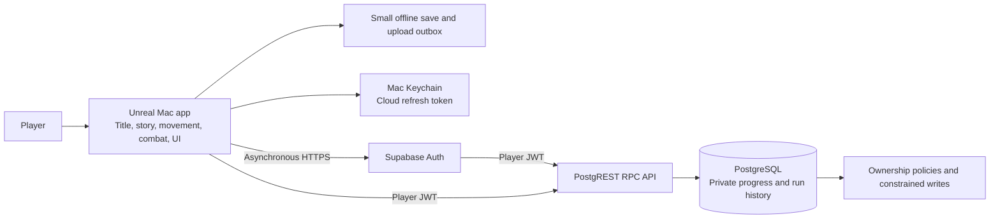

# Product architecture and acceptance criteria

Piece of Cake is an Unreal native game with a Supabase cloud backend. The optional browser client displays Pixel Streaming video; it does not replace or run the native renderer.

| Area | Implemented | Verification / current boundary |
| --- | --- | --- |
| Native frontend | Original Nori mascot, animated title, intentional cake thought sequence, settings, controls and cloud panel | Packaged screenshots and intro transition assertions; not a webpage launcher |
| Gameplay | Eight enclosed districts, free ground movement, double jump, dash, spin, bombs, enemies, Echo, checkpoints, two reward switches, cake and restart | Actual packaged engine traversal; manual play remains important |
| Authentication | Private anonymous Supabase identity and rotating refresh token in Mac Keychain | No emails collected; no cross-device recovery yet |
| API | Authenticated HTTPS RPCs, 8-second async timeout, explicit save states | Real HTTPS isolation tests and native save/upload plus new-process Keychain restore pass |
| Database | Progress and run tables, constraints, ownership RLS, monotonic merge, idempotent uploads | Nine PostgreSQL test results including the parent suite |
| Offline resilience | Small local cache plus at most 100 pending completed runs | Unreal serialization and new-process persistence checks |
| Leaderboard | Generated nickname and best non-assisted completed time | Casual client-reported scores; not cheat-proof or suitable for prizes |
| Performance | 1280×720 native default, warmed graphics state, resident audio, bounded actors, 60 FPS cap | Packaged frame-time reports, tested on this M4 Mac only |
| Distribution | Self-contained Apple-silicon app and verified ZIP, dependency/signature checks | Ad-hoc signing; not Apple notarized, not an Intel/Windows build |
| CI | Python gameplay-data tests, PostgreSQL rules, web tests and production frontend build | Standard free public-repository GitHub runner; Unreal runtime tests remain local |
| Secrets | Public project key in app; session token in Keychain; private QA profiles ignored | No database password or service-role key in source/bundle |
| Operations | Honest cloud status and reproducible schema, build, test and archive scripts | Free project may pause; manual backups; no paid usage enabled |

“AAA” describes the desired polish, not a measured or achieved certification. Source checks, studio icon renders and a successful cook do not establish runtime quality. Use `docs/TEST_RESULTS.md` and the corresponding runtime reports to assess what was actually tested.
